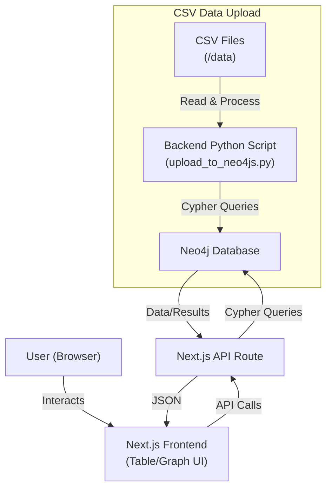

# 📚 Neo4j Book Knowledge Graph — POC_Project

---

## 🎥 Demo Video

> **Watch a 5–10 minute walkthrough of the app running on a development server:**
>
> [](https://www.loom.com/share/4f4272365a81478d8d77541158c0a1e6?sid=101d484b-1cb6-4bfa-ac57-ea440b2b0702)
>

---

## 🏗️ Solution / Architecture

- **Frontend:** Next.js (React, Tailwind CSS)
  - Table view with advanced filters (Author, Book, Tag, Relationship)
  - Interactive graph visualization (Cytoscape.js + cose-bilkent layout)
  - API routes for data fetching
- **Backend:** Python scripts (for Neo4j data upload/processing)
- **Database:** Neo4j (Graph Database)
- **Data:** CSV files (books, tags, ratings, etc.) in `/data`

**Architecture Diagram:**



---

## 📖 Documentation

### 1. Prerequisites
- Node.js (v18+ recommended)
- Python 3.x (for backend scripts)
- Neo4j (local or remote instance)

### 2. Setup

#### a. Clone the repository
```bash
git clone https://github.com/Rahul-Ganatra/POC_Project.git
cd POC_Project
```

#### b. Install frontend dependencies
```bash
cd frontend
npm install
```

#### c. Configure Neo4j connection
Create a `.env.local` file in `frontend/`:
```
NEO4J_URI=bolt://localhost:7687
NEO4J_USER=neo4j
NEO4J_PASSWORD=your_password
```

#### d. (Optional) Prepare data and upload to Neo4j
- Place your CSV files in `/data`.
- Use the provided Python scripts in `/backend` to upload data to Neo4j:
```bash
cd backend
python upload_to_neo4js.py
```

#### e. Start the development server
```bash
cd frontend
npm run dev
```
Visit [http://localhost:3000](http://localhost:3000) in your browser.

### 3. How to Use
- **Table View:** Filter and explore all relationships (author, book, tag, relationship type).
- **Graph View:** Click "View Graph Structure" to see the interactive knowledge graph. The graph updates based on filters applied in the table view.
- **Switch views:** Use the navigation buttons to toggle between table and graph.

---

## 💻 Source Code

- **Frontend:** [`/frontend`](./frontend)
- **Backend scripts:** [`/backend`](./backend)
- **Data files:** [`/data`](./data)
- **This README:** [`README.md`](./README.md)

---

## 🙏 Credits & License

- Built with [Next.js](https://nextjs.org/), [Cytoscape.js](https://js.cytoscape.org/), [Neo4j](https://neo4j.com/)
- MIT License

---

> _For questions or contributions, please open an issue or pull request!_

---

<p align="center">Made with ❤️ by Rahul Jignesh Ganatra</p>
